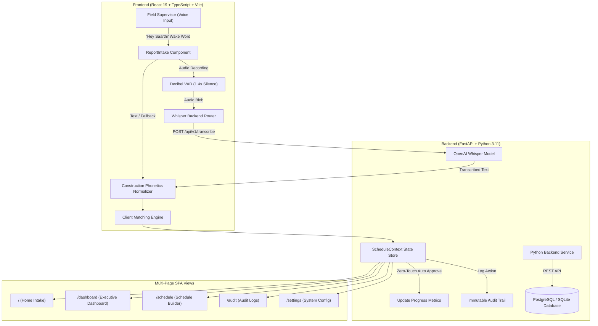

# 🧭 SAARTHI — Intelligent Data Capture & Real-Time Progress Tracking

> **Smart India Hackathon 2026 · Problem Statement ID: SIH26122**  
> *Category: Infrastructure & Construction Management · Team Hail Mary*

---

[](https://react.dev/)
[](https://www.typescriptlang.org/)
[](https://vitejs.dev/)
[](https://tailwindcss.com/)
[](https://fastapi.tiangolo.com/)
[](https://github.com/openai/whisper)
[](https://www.python.org/)
[](https://www.docker.com/)

---

## 📌 Executive Summary & Problem Statement

In major infrastructure and civil engineering projects, site progress tracking remains heavily manual, fragmented, and delayed. Site supervisors often submit handwritten logs, disjointed WhatsApp voice notes, or physical reports days after work occurs. This leads to **cost overruns, unverified progress claims, missing audit trails, and zero real-time executive visibility**.

**SAARTHI** is an **AI-powered Planning-to-Execution bridge** that solves SIH Problem Statement **SIH26122**. It captures raw hands-free voice dictation (triggered by a custom `"Hey Saarthi"` wake word with decibel-based Voice Activity Detection) or text updates, normalizes construction domain terminology & phonetics, matches reports against master schedule baselines using a multi-factor matching engine, and executes **zero-touch autonomous auto-approvals** to update progress metrics instantly while logging an immutable audit record.

---

## ⚡ Key Features

### 🎙️ 1. Hands-Free Voice Intake & Wake-Word Engine ("Hey Saarthi")
* **Custom Wake-Word Detection**: Continuous background listener waiting for `"Hey Saarthi"` (or customized voice wake triggers).
* **Decibel RMS Voice Activity Detection (VAD)**: Real-time audio spectrum analyzer tracks microphone input decibels; automatically submits field reports after **1.4 seconds of silence**.
* **OpenAI Whisper AI Server Integration**: Server-side audio transcription via `POST /api/v1/transcribe` utilizing OpenAI's Whisper model (`base`), ensuring high accuracy even in noisy construction site environments.
* **Resilient Web Speech Fallback**: Includes client-side Web Speech API parsing with exponential backoff and error throttling if server endpoints are unreachable.

### 🏗️ 2. Construction Domain Normalization & Phonetics
* Domain-specific phonetic dictionary (`constructionPhonetics.ts` & `backend/app/utils/phonetics.py`) converts spoken slang, shorthand, and numbers into structured construction terminology.
* Normalizes spoken phrases:
  * `"jon a"` $\rightarrow$ `Zone A`
  * `"raft foundation pour eighty five percent"` $\rightarrow$ `Raft Foundation Concrete Pour (85% Progress)`
  * `"column casting complete"` $\rightarrow$ `Column Reinforcement & Casting (100% Progress)`

### 🎯 3. Multi-Factor Schedule Matching Engine
Candidate schedule activities are evaluated using a weighted multi-factor scoring model:
$$\text{Confidence Score} = w_{\text{semantic}} \cdot S_{\text{semantic}} + w_{\text{location}} \cdot S_{\text{location}} + w_{\text{date}} \cdot S_{\text{date}}$$
* **Semantic Match Score (50%)**: Token overlap, domain synonym mapping, and Levenshtein string distance.
* **Spatial Location Score (35%)**: Extracted spatial zone matching against planned activity zones.
* **Date & Status Plausibility (15%)**: Evaluates current activity state (`not_started` $\rightarrow$ `in_progress` $\rightarrow$ `completed`).
* **Progress Confidence**: Extracts numerical percentages and completion keyphrases.

### ⚡ 4. Zero-Touch Autonomous Auto-Approval
* **Autonomous Execution**: High-confidence matches ($\ge 50\%$) automatically update actual progress, advance activity status, and recalculate overall project progress metrics without human intervention.
* **Visual & Audio Feedback**: Celebratory particle confetti animations (`canvas-confetti`) provide clear supervisor feedback.
* **Immutable Audit Trail**: Every automated action records a timestamped audit log entry tracking original raw report text, matched activity ID, confidence score, and progress delta.

### 🧭 5. Multi-Page Dark Blueprint SPA
Built with a sleek, high-tech civil engineering blueprint visual design system:
* **`/` (Home / Intake)**: Streamlined intake station featuring voice dictation, text entry, site attachment stubs, and lightweight inline match summaries.
* **`/dashboard` (Dashboard)**: Executive metric overview cards and full `MatchingEngine` candidate breakdown with interactive manual review queues for low-confidence matches.
* **`/schedule` (Schedule)**: Interactive `ScheduleBuilder` for creating, updating, and deleting schedule activities alongside a baseline preset switcher (Metro Rail, Highway, High-Rise Tower).
* **`/audit` (Audit Log)**: Full audit history table displaying verified report submissions and zero-touch auto-approvals.
* **`/settings` (Settings)**: Control panel for toggling Zero-Touch Autonomous Mode, Gemini API configuration, custom wake phrases, and baseline schedule presets.

---

## 🛠️ System Architecture



---

## 🧰 Tech Stack

### Frontend Application
| Technology | Description |
| :--- | :--- |
| **React 19** | Core UI library with modern hook architecture |
| **TypeScript 5** | End-to-end type safety for domain models |
| **Vite 8** | High-performance lightning-fast development server & bundler |
| **React Router DOM 7** | Client-side multi-page SPA navigation |
| **Tailwind CSS v4** | Modern utility-first styling for dark blueprint theme |
| **Lucide React** | Civil engineering & blueprint iconography |
| **Canvas Confetti** | Zero-Touch celebratory visual feedback |

### Backend Service & AI Models
| Technology | Description |
| :--- | :--- |
| **FastAPI** | Modern, fast Python web framework for asynchronous REST APIs |
| **Uvicorn** | High-performance ASGI web server |
| **OpenAI Whisper** | Server-side speech-to-text model (`base`) via PyTorch |
| **SQLAlchemy 2.0** | Object-Relational Mapping (ORM) for DB models |
| **SQLite / PostgreSQL** | Local dev database with PostgreSQL production capability |
| **Alembic** | Database migration management |
| **PyJWT & Bcrypt** | Secure password hashing and JSON Web Token authentication |
| **Docker Compose** | Multi-container orchestration (FastAPI + Postgres) |

---

## 📁 Project Directory Structure

```
SARTHII/
├── CONTEXT.md                    # Single-file complete technical reference context
├── Roadmap.md                    # Project development roadmap & feature tracking
├── README.md                     # GitHub repository overview & usage instructions
├── package.json                  # Frontend dependencies and Vite build scripts
├── vite.config.ts                # Vite configuration with React & Tailwind plugins
├── index.html                    # SPA HTML entry point
│
├── src/                          # Frontend Source Code
│   ├── main.tsx                  # React DOM entrypoint
│   ├── App.tsx                   # Top-level router wrapper with ScheduleProvider & Navbar
│   ├── index.css                 # Global blueprint aesthetic styles & scrollbars
│   ├── types/
│   │   └── index.ts              # TypeScript domain types (Activity, MatchResult, AuditRecord)
│   ├── context/
│   │   └── ScheduleContext.tsx   # Centralized React Context state provider
│   ├── components/
│   │   ├── Navbar.tsx            # Persistent top titleblock navigation bar
│   │   ├── ReportIntake.tsx      # Voice intake ("Hey Saarthi"), decibel VAD & Whisper integration
│   │   ├── MatchingEngine.tsx    # Candidate match breakdown & sub-score metrics
│   │   ├── ScheduleBuilder.tsx   # Activity CRUD manager & preset switcher
│   │   ├── AuditLog.tsx          # Immutable timestamped audit log table
│   │   └── BlueprintHeaderFooter.tsx # Blueprint engineering title block & stamp footer
│   ├── pages/
│   │   ├── HomePage.tsx          # Route '/' — Field Intake station & lightweight summary
│   │   ├── DashboardPage.tsx     # Route '/dashboard' — Overview cards & MatchingEngine
│   │   ├── SchedulePage.tsx      # Route '/schedule' — Baseline schedule builder
│   │   ├── AuditPage.tsx         # Route '/audit' — Audit history log table
│   │   └── SettingsPage.tsx      # Route '/settings' — Zero-Touch toggle & AI engine config
│   └── utils/
│       ├── constructionPhonetics.ts # Domain spoken text normalizer & jargon dictionary
│       ├── matchingAlgorithm.ts # Heuristic schedule matching algorithm
│       └── presets.ts            # Baseline schedule presets (Metro, Highway, Tower)
│
└── backend/                      # FastAPI Python Backend Infrastructure
    ├── Dockerfile                # Python 3.11 container manifest
    ├── docker-compose.yml        # Orchestrates FastAPI + PostgreSQL services
    ├── requirements.txt          # Python packages (FastAPI, Whisper, Torch, SQLAlchemy)
    ├── test_backend.py           # Comprehensive automated API test suite
    └── app/
        ├── main.py               # FastAPI application entrypoint & CORS setup
        ├── config.py             # Pydantic BaseSettings (DB URL, JWT secret keys)
        ├── database.py           # SQLAlchemy engine & session manager
        ├── security.py           # Direct Bcrypt hashing & JWT utilities
        ├── models/               # SQLAlchemy DB models (User, Project, Activity, Report, Audit)
        ├── schemas/              # Pydantic request/response validation schemas
        ├── routers/              # REST Endpoints (/auth, /projects, /activities, /reports, /transcribe)
        └── utils/
            ├── phonetics.py      # Python port of construction phonetics normalizer
            └── matching.py       # Python port of multi-factor schedule matching engine
```

---

## 🚀 Quickstart & Local Setup

### Prerequisites
* **Node.js**: v18.0.0 or higher
* **npm**: v9.0.0 or higher
* **Python**: v3.11 or higher (for backend & Whisper model)
* **FFmpeg**: Installed on system path (required for Whisper audio decoding)

---

### 1. Frontend Development Setup

```bash
# Clone the repository
git clone https://github.com/randomrett/SARTHII.git
cd SARTHII

# Install dependencies
npm install

# Start Vite development server
npm run dev
```

Frontend application runs at: **`http://localhost:5173`**

To verify the production build:
```bash
npm run build
```

---

### 2. Backend Python Setup (FastAPI & Whisper Server)

```bash
# Navigate to backend directory
cd backend

# Create Python virtual environment
python -m venv venv

# Activate virtual environment
# Windows (PowerShell):
.\venv\Scripts\activate
# Linux/macOS:
source venv/bin/activate

# Install Python backend dependencies
pip install -r requirements.txt

# Run Uvicorn dev server
uvicorn app.main:app --reload --port 8000
```

Backend API service runs at: **`http://localhost:8000`**  
Interactive Swagger API Documentation: **`http://localhost:8000/docs`**

To execute automated backend verification tests:
```bash
python test_backend.py
```

---

### 3. Docker Compose Setup (FastAPI + PostgreSQL)

```bash
cd backend
docker compose up --build
```

---

## 📡 Backend REST API Reference Summary

| Endpoint | Method | Description |
| :--- | :--- | :--- |
| `/api/v1/health` | `GET` | System health & status check |
| `/api/v1/transcribe` | `POST` | Upload audio file (`audio/webm`, `audio/wav`) for OpenAI Whisper transcription |
| `/api/v1/auth/register` | `POST` | Register site supervisor account |
| `/api/v1/auth/login` | `POST` | Authenticate user & receive JWT access token |
| `/api/v1/projects` | `GET` / `POST` | List or create construction projects |
| `/api/v1/activities` | `GET` / `POST` | Fetch or add master schedule activities |
| `/api/v1/reports` | `GET` / `POST` | Submit field progress reports |
| `/api/v1/match` | `POST` | Evaluate raw report text against schedule activities |
| `/api/v1/audit` | `GET` | Fetch timestamped system audit log entries |

---

## 🏆 Hackathon Details & Acknowledgments

* **Hackathon**: Smart India Hackathon 2026 (SIH 2026)
* **Problem Statement**: SIH26122 — Intelligent Data Capture & Real-Time Progress Tracking
* **Team**: Hail Mary
* **Repository**: [github.com/randomrett/SARTHII](https://github.com/randomrett/SARTHII)

---

<p center="align">
  <i>Developed with ❤️ by Team Hail Mary for Smart India Hackathon 2026.</i>
</p>
